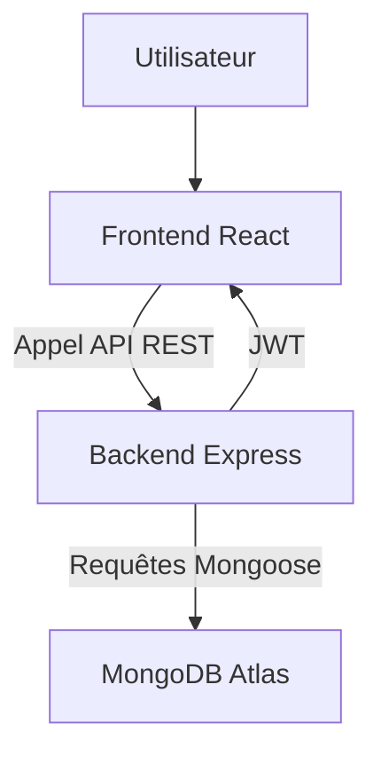

# 🌐 Projet Full Stack JS (EFREI)

Ce projet est un **Full Stack JavaScript** complet, combinant un **frontend React + TypeScript + Vite** et un **backend Node.js + Express + MongoDB**, le tout facilement **déployable via Docker**.

Il s'agit d'une application de **gestion de contacts sécurisée**, avec **authentification JWT**, **interface moderne (MUI)**, et **API REST documentée avec Swagger**.

Elle est déployée sur mon serveur à cette adresse : https://efrei-fullstack-js.remipetit.fr

---

## 🚀 Déploiement rapide avec Docker

Le moyen le plus simple de lancer l'application est d'utiliser **Docker Compose**.

### 1️⃣ Cloner le dépôt

```bash
git clone https://github.com/Remi-Petit/Projet_Full_Stack_JS_Efrei.git
cd Projet_Full_Stack_JS_Efrei
```

### 2️⃣ Configurer les variables d'environnement

Un fichier `.env` est déjà présent à la racine du projet.
Il contient les configurations pour **le frontend et le backend** :

```bash
# Backend
VITE_PROTOCOL_API=http
VITE_HOST_API=localhost
VITE_PORT_API=3300
MONGODB_URI=mongodb+srv://... # Ton URI MongoDB Atlas
JWT_SECRET=ton_secret_super_secure_123
JWT_EXPIRES_IN=1h

# Frontend
VITE_PROTOCOL=http
VITE_HOST=localhost
VITE_PORT=5010

# Mode de déploiement\VITE_ENV_MODE=development
```

Tu peux adapter ces valeurs selon ton environnement.

### 3️⃣ Lancer l’application 🚢

```bash
docker compose up --build
```

Le frontend et le backend seront lancés automatiquement :

* 🧠 **Backend** : [http://localhost:3300/api](http://localhost:3300/api)
* ⚛️ **Frontend** : [http://localhost:5010](http://localhost:5010)

Une fois lancé, le frontend communique directement avec le backend via les variables d’environnement transmises à la build Docker.

---

## ⚙️ Structure du projet

```
Projet_Full_Stack_JS_Efrei/
├── frontend/       # Client React (Vite + TypeScript + Redux + MUI)
├── backend/        # Serveur Node.js / Express / MongoDB
├── docker-compose.yml
├── .env            # Variables d'environnement communes
└── README.md        # Documentation principale
```

Chaque dossier (`frontend/` et `backend/`) contient son propre **README détaillé** :

* 📘 **[frontend/README.md](./frontend/README.md)** : instructions pour le client React
* 📗 **[backend/README.md](./backend/README.md)** : instructions pour l’API Express

---

## 🧩 Technologies principales

| Côté               | Technologie               | Description                                 |
| ------------------ | ------------------------- | ------------------------------------------- |
| 🖥️ Frontend       | React + TypeScript + Vite | Application SPA performante                 |
| 🎨 UI              | Material UI (MUI v5)      | Interface moderne et réactive               |
| 🔄 State           | Redux Toolkit             | Gestion globale de l'état (auth & contacts) |
| ⚙️ Backend         | Node.js + Express         | API REST sécurisée                          |
| 🧮 Base de données | MongoDB Atlas             | Stockage cloud                              |
| 🔐 Auth            | JWT                       | Authentification et protection des routes   |
| 🧾 Tests           | Jest + Supertest          | Tests unitaires et d'intégration            |
| 🐳 Déploiement     | Docker + Docker Compose   | Lancement rapide des services               |

---

## 🔑 Fonctionnalités principales

✅ Authentification sécurisée via JWT
✅ Gestion des contacts (CRUD complet)
✅ Interface utilisateur fluide (React + MUI)
✅ API documentée (Swagger /docs)
✅ Configuration flexible avec `.env`
✅ Déploiement instantané avec Docker Compose

---

## 🧪 Tests & Environnements

Pour lancer les tests backend :

```bash
cd backend
npm test
```

> 💡 Pense à mettre `VITE_ENV_MODE=test` dans ton `.env` pour activer la base de données en mémoire.

---

## 📜 Exemple de configuration Docker Compose

```yaml
version: '3.8'

services:
  frontend:
    container_name: fullstack-js-frontend
    build:
      context: ./frontend
      dockerfile: Dockerfile
      args:
        - VITE_ENV_MODE=${VITE_ENV_MODE}
        - VITE_PROTOCOL_API=${VITE_PROTOCOL_API}
        - VITE_HOST_API=${VITE_HOST_API}
        - VITE_PORT_API=${VITE_PORT_API}
        - VITE_PROTOCOL=${VITE_PROTOCOL}
        - VITE_HOST=${VITE_HOST}
        - VITE_PORT=${VITE_PORT}
    ports:
      - "${VITE_PORT}:80"
    environment:
      - NODE_ENV=${VITE_ENV_MODE}
    depends_on:
      - backend
    volumes:
      - ./frontend:/app

  backend:
    container_name: fullstack-js-backend
    build:
      context: ./backend
      dockerfile: Dockerfile
    ports:
      - "${VITE_PORT_API}:3300"
    environment:
      - NODE_ENV=${VITE_ENV_MODE}
    volumes:
      - ./backend:/app
      - ./.env:/.env
```

---

## 🧭 Aperçu du fonctionnement



---

## 👨‍💻 Auteur

👤 **Rémi Petit**
EFREI - Projet Full Stack JS
📧 [remi.petit93370@gmail.com](mailto:remi.petit93370@gmail.com)

---

> *"Un projet complet, modulaire et dockerisé, prêt à déployer en un clic."*
> *"Merci Docker, merci ChatGPT."*
