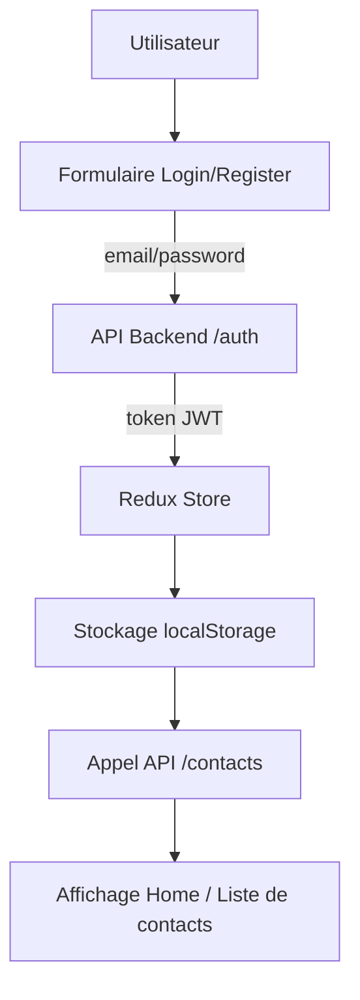

# ⚛️ Frontend - Projet Full Stack JS (EFREI)

Frontend développé avec **React + TypeScript + Vite**, utilisant **Redux Toolkit** pour la gestion d’état globale et **Material UI (MUI)** pour le design.
Ce client se connecte au backend Node.js/Express via une API REST sécurisée par JWT.

---

## 🚀 Introduction

Ce frontend constitue la partie **interface utilisateur** du projet Full Stack JS.
Il permet :

* L’**inscription** et la **connexion** des utilisateurs via le backend,
* La **gestion complète des contacts** (CRUD),
* L’accès sécurisé grâce à un **token JWT** stocké dans `localStorage`.

---

## 🧰 Stack technique

| Élément          | Technologie                  |
| ---------------- | ---------------------------- |
| Framework        | React 18 + TypeScript + Vite |
| État global      | Redux Toolkit                |
| UI               | Material UI (MUI v5)         |
| Routing          | React Router DOM             |
| API              | Fetch + VITE_API_URL (env)   |
| Authentification | JWT (géré côté frontend)     |
| Build            | Vite                         |

---

## ⚙️ Installation & lancement

### 1️⃣ Cloner le dépôt

```bash
git clone https://github.com/Remi-Petit/Projet_Full_Stack_JS_Efrei.git
cd Projet_Full_Stack_JS_Efrei/frontend
```

### 2️⃣ Installer les dépendances

```bash
npm install
```

### 3️⃣ Lancer le serveur de développement

```bash
npm run dev
```

L’application sera accessible sur [http://localhost:5010](http://localhost:5010).

---

## 🧩 Architecture du projet

```
frontend/
├── src/
│   ├── api/               # Fonctions d'appel à l'API (auth & contacts)
│   │   ├── authApi.ts
│   │   └── contactApi.ts
│   ├── components/        # Composants réutilisables (formulaires, navbar, etc.)
│   ├── pages/             # Pages principales (Home, Login, Register)
│   ├── routes/            # Définition des routes (AppRoutes + ProtectedRoute)
│   ├── stores/            # Store Redux et slices (authSlice)
│   ├── App.tsx            # Racine de l’application React
│   ├── main.tsx           # Point d’entrée principal
│   └── index.css          # Styles globaux
├── package.json
├── tsconfig.json
├── vite.config.ts
└── .env
```

---

## 💡 Fonctionnalités principales

✅ **Authentification sécurisée**

* Enregistrement et connexion via l’API backend
* Gestion du token JWT dans `localStorage`
* Protection des routes privées via `ProtectedRoute`

✅ **Gestion des contacts (CRUD)**

* Création, modification, suppression, et affichage des contacts de l’utilisateur connecté
* Les appels sont réalisés avec le token JWT dans le header `Authorization`

✅ **Interface utilisateur réactive et claire**

* Design moderne avec Material UI
* Messages d’erreur clairs (MUI Alert)
* Navigation fluide grâce à React Router

---

## 🧠 Pages principales

| Page            | Chemin      | Description                                                         |
| --------------- | ----------- | ------------------------------------------------------------------- |
| 🏠 **Home**     | `/`         | Page principale protégée, liste les contacts et permet d’en ajouter |
| 🔐 **Login**    | `/login`    | Connexion utilisateur (redirection vers `/` après succès)           |
| 🧾 **Register** | `/register` | Création de compte utilisateur                                      |

---

## 🔑 Authentification

* Le **token JWT** est reçu depuis le backend après login/register.
* Il est stocké dans **Redux** et dans le **localStorage**.
* Toutes les requêtes API incluent ce token dans les headers :

```js
Authorization: Bearer <token>
```

### Exemple de persistance locale :

```js
localStorage.setItem('token', data.token);
localStorage.setItem('user', JSON.stringify(data.user));
```

---

## 🧪 Scripts utiles

| Commande          | Description                                        |
| ----------------- | -------------------------------------------------- |
| `npm run dev`     | Lance le serveur de développement                  |
| `npm run build`   | Construit la version de production                 |
| `npm run preview` | Lance un serveur local pour prévisualiser le build |

---

## 🧰 API utilisée

### Auth

* `POST /api/auth/register` → Inscription
* `POST /api/auth/login` → Connexion

### Contacts

* `GET /api/contacts` → Récupère les contacts
* `POST /api/contacts` → Crée un contact
* `PUT /api/contacts/:id` → Met à jour un contact
* `DELETE /api/contacts/:id` → Supprime un contact

> 🔗 L’URL de base de l’API est définie par le fichier `.env`, situé à la racine de ce repo.

---

## 🧪 Identifiants de test (exemple)

Tu peux utiliser ce compte de test :

```json
{
  "email": "jolyne.kujo@gmail.com",
  "password": "MotDePasseBienSecret123!"
}
```

Ou bien en créer un nouveau via la page **Inscription**.

---

## 🧱 Sécurité intégrée

* 🔐 JWT pour protéger les routes
* ⚙️ Stockage du token sécurisé dans localStorage (non accessible aux cookies HTTPOnly)
* 🧰 Validation des entrées (frontend et backend)
* 🚧 Redirection automatique vers /login si non authentifié

---

## 🧭 Exemple de flux utilisateur



---

## 👨‍💻 Auteur

👤 **Rémi Petit**
EFREI - Projet Full Stack JS
📧 [remi.petit93370@gmail.com](mailto:remi.petit93370@gmail.com)

---

> *« Un frontend clair, rapide et connecté au monde. »*

> *« Sacré ChatGPT hein ? »*